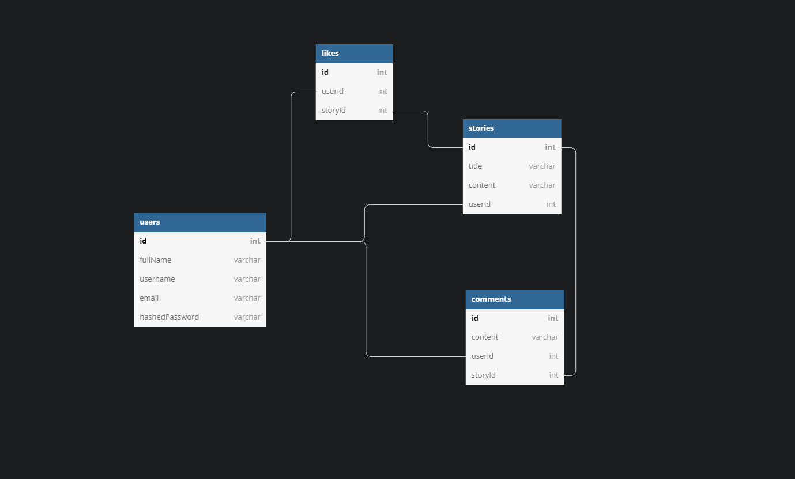
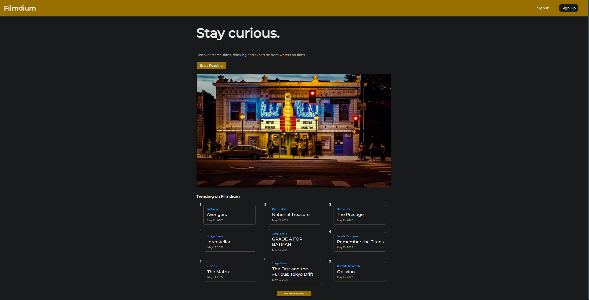
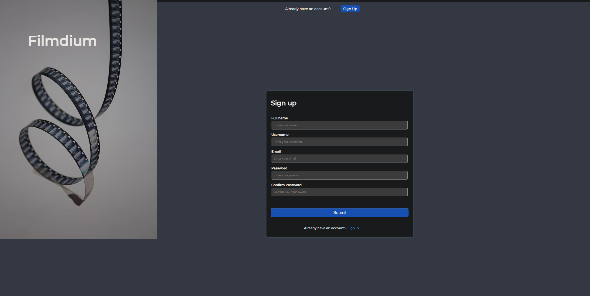
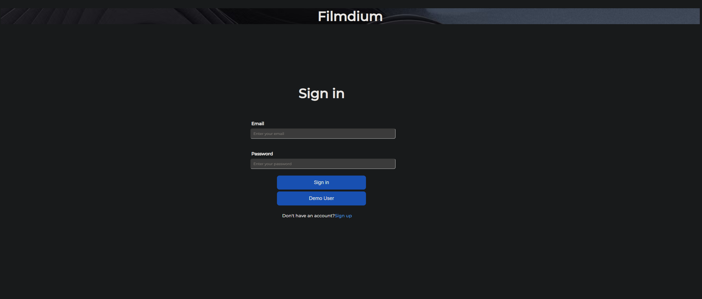
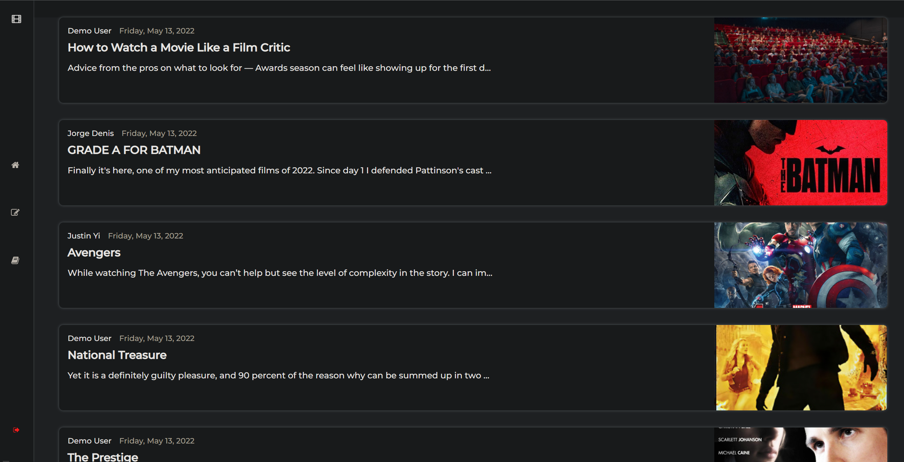
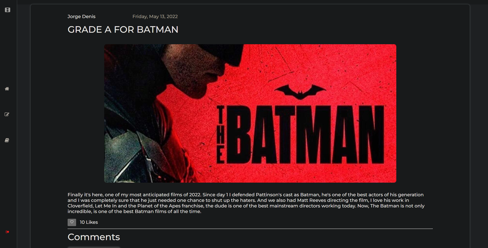
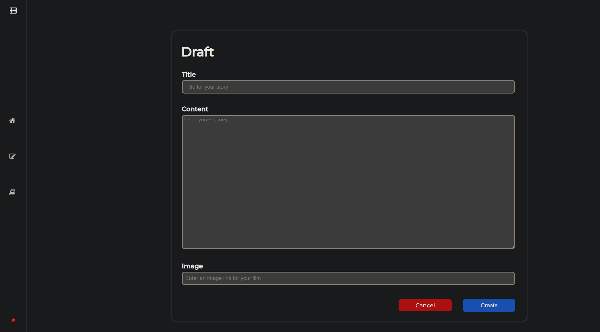

# filmdium

Filmdium is an open platform where film lovers find dynamic thinking, and where expert and undiscovered voices can share their writing on any film.

## To start the development environment
- ```npm install```
- ```npm run dev```

## This project was made with:
- JavaScript
- express.js
- pug
- postgres
- sequelize
- HTML
- CSS
- Heroku

## Link to Live Site
- https://filmdium.herokuapp.com/

## Link to Wiki docs
- https://github.com/OsvaldoSalomon/filmdium/wiki

## Database Schema:


## Home Page:


## Register Page:


## Log-In Page:


## View List of Stories:


## Story Page:


## Adding a New Story Page:


## Discussion of two features that show off the team's technical abilities

Added comment and like features so that users can share their thoughts on stories that are posted. Comments can only be edited or deleted by the owner of the comment. The user can also only like the story once and if the user has already liked the story, then it will unlike the story instead.

### After liking and creating a comment for the story:


## Discussion of both challenges faced and the way the team solved them

One of the challenges was adding the like feature. It was initially thought to be two API-Routes: one to post a like and one to delete the like. But only the post route for the like feature was needed as we could change the display dynamically using DOM manipulation. So rather than using a delete route for the like, we added an event listener to the like button and create a condition so that the story can only be liked once per user. For the post route for the like, we checked to see if the like existed according to the userId and storyId and to either create or delete the like.

Another challenge that was faced was how to only display the edit and delete buttons for the comments that were created by the logged-in user. We realized that we could simply create a condition in the pug file for the page to know when to display the edit and delete buttons for a comment. We just had to define the logged-in userId to pass into the pug file and create a condition for the story's userId to be the same as the logged-in userId.
## Code snippets to highlight the best code

Defining the userId of logged-in user in routes and creating a condition in the pug file

```
router.get("/:id(\\d+)", csrfProtection, asyncHandler(async (req, res) => {
    let loggedInUserId
    const storyId = req.params.id
    const story = await db.Story.findByPk(req.params.id, {
        include: [{
            model: db.User,
            as: 'author',
        }, {
            model: db.Comment,
            include: db.User
        }, {
            model: db.Like
        }
        ]

    })
    if (req.session.auth) {
        loggedInUserId = req.session.auth.userId
    }
    let allLikes = await db.Like.findAll({
        where: { storyId }
    })
    let likes = allLikes.length
    const like = await db.Like.findOne({
        where: {
            storyId,
            userId: loggedInUserId
        }
    })
    res.render("story", { story, storyId, like, likes, loggedInUserId, csrfToken: req.csrfToken() })
}))

each comment in story.Comments
    div(class='comment' id=`comments-container-${comment.id}`)
        p(class='comment-date')=comment.createdAt.toLocaleDateString('en-US', { hour: '2-digit', minute:'2-digit', weekday: 'long', year: 'numeric', month: 'long', day: 'numeric' })
        p(id=`comments-author-${comment.id}`)=comment.User.fullName
        hr
        p(type='submit' id=`comments-content-${comment.id}`)=comment.content
        if loggedInUserId === comment.User.id
            button(class="button edit-btn" id=`edit-comment-${comment.id}`) Edit
            button(class="button delete-btn" id=`delete-comment-${comment.id}`) Delete
            div(class=`error-div-${comment.id}`)
```

## Features
- Users can sign-up, log-in, and log out
- Users can log-in as demo user to check application
- Users cannot use certain features without being logged-in like posting stories or liking/commenting on a story.
- Logged-in users can post/edit/delete their own stories
- All users can view most recent stories
- Logged-in users can post/edit/delete their own comments
- Logged-in users can post/delete their own likes

## Future Features
- Logged-in users can add/remove a bookmark to a story
- Logged-in users can add/remove topics to their stories
- All users can click on a topic to view a lis of recent stories that contain that topic
- All users can search topics and users
